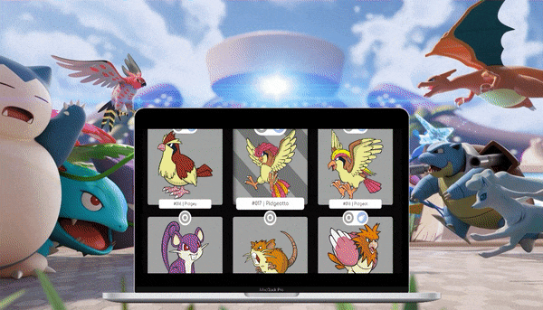
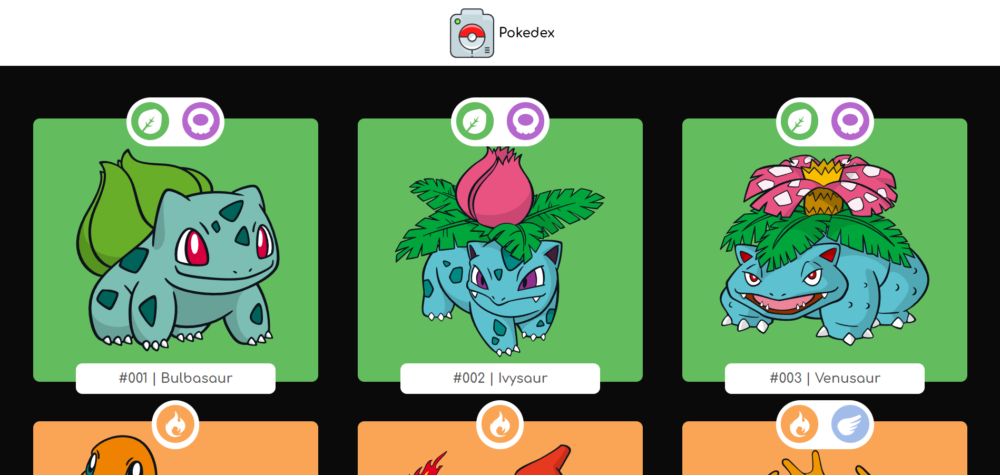

<div align="center" id="top"> 
   <a href="https://tgbr.site/pokedex_html" target="_blank"></a>

&#xa0;

<a href="https://td-pokedex.surge.sh">Demo</a>

</div>

<h1 align="center">Pokedex</h1>

<p align="center">
  

  

  

  

</p>
<p align="center">
  <a href="#dart-sobre">Sobre</a> &#xa0; | &#xa0;
  <a href="#rocket-tecnologias">Tecnologias</a> &#xa0; | &#xa0;
  <a href="#white_check_mark-pré-requisitos">Pré requisitos</a> &#xa0; | &#xa0;
  <a href="#checkered_flag-começando">Começando</a> &#xa0; | &#xa0;
  <a href="#memo-licença">Licença</a> &#xa0; | &#xa0;
  <a href="https://github.com/thiilins" target="_blank">Autor</a>
</p>

<br>
  <a href="https://td-pokedex.surge.sh" target="_blank"></a>
 <br>
<br>

## :dart: Sobre

Pokedex desenvolvida com HTML, CSS e Javascript, Consumindo a PokéAPI com o intuito de praticar o consumo de API via front com o JavaScript e estilização CSS.
<br>
<br>

## :rocket: Tecnologias

As seguintes ferramentas foram usadas na construção do projeto:

  
[](https://pokeapi.co/) <br><br>

## :white_check_mark: Pré requisitos

Antes de começar :checkered_flag:, você precisa ter o [Git](https://git-scm.com) e o [VSCODE](https://nodejs.org/en/) com a extensão [Live Server](https://marketplace.visualstudio.com/items?itemName=ritwickdey.LiveServer) instalados em sua maquina.
<br><br>

## :checkered_flag: Começando

```bash
# Clone este repositório
$ git clone https://github.com/thiilins/pokedex

# Entre na pasta
$ cd pokedex

# Abra com o VSCODE
$ code .
#Inicie com o live server
# por padrão o  app vai inicializar em <http://localhost:5500>
```

<br><br>

## :memo: Licença

Este projeto está sob licença MIT. Veja o arquivo [LICENSE](LICENSE.md) para mais detalhes.

Feito com :heart: por <a href="https://github.com/thiilins" target="_blank">Thiago Lins</a>

&#xa0;

<div align="right" >
<a  href="#top">(Voltar para o topo)</a>
</div>
